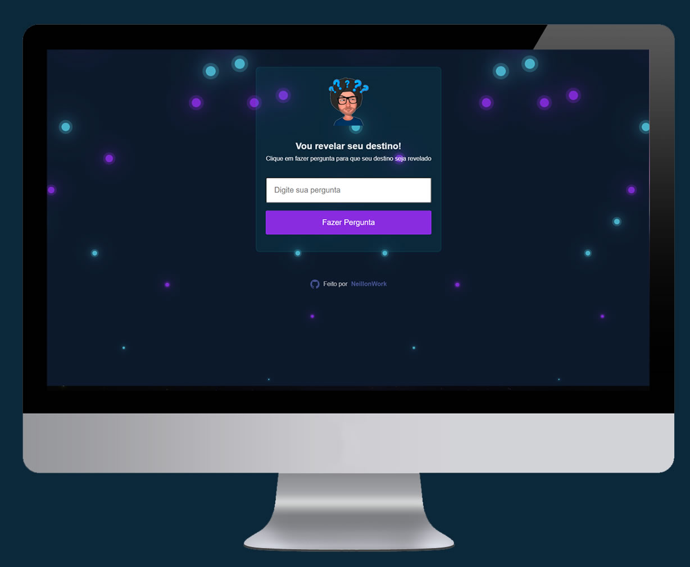
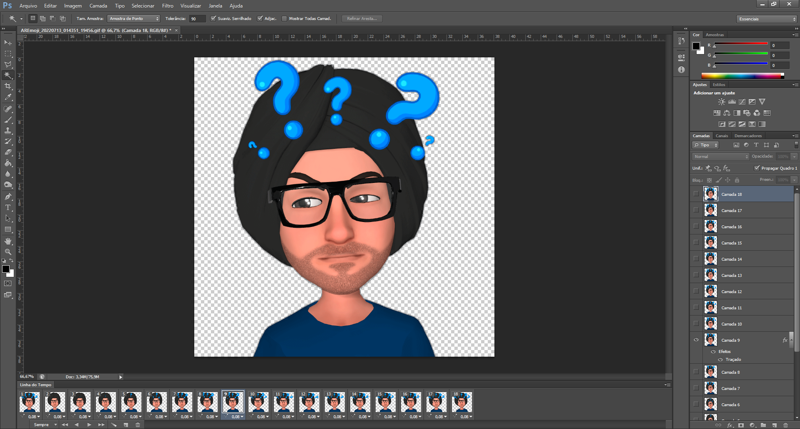

# Vou-revelar-seu-destino

Estudo Front-end em desenvolvimento ...

<a href="#imagens">Imagens </a> -
<a href="#sobre">Sobre </a> -
<a href="#features">Features </a> -
<a href="#tecnologias">Tecnologias </a> -
<a href="#executar">Como executar o projeto</a> -
<a href="#autor">Autor </a>

# Imagens

- Responsividade desktop e mobile utilizando "flex". 
- Avatar criado através do App <b>"Stickers Emoji AR"</b> e fundo transparente editado através do <b>Photoshop CS6</b>.  

- Referencia de Inspiração para o fundo animado:
<a href="https://youtu.be/wuUSVEcK-kM" target="_blank">CSS Only Animated Background Effects </a>

<table border>
    <tr>
        <td>Desktop</td>
        <td>Mobile</td>
        <td>Avatar</td>
    </tr>
    <tr>
        <td></td>
        <td></td>
        <td></td>
    </tr>
</table>

# Sobre

    Estudo realizado através da Maratona Explorer - Rocketseat. Aplicação com a função de "Clique em fazer pergunta para que seu destino seja revelado"

# Features
Desafios adicionais inserido ao projeto:
- [x] Implementado responsividade com display flex.
- [x] Criado animação de background.
- [x] Adicionado switch case com novos fluxos de respostas ao arquivo .js.
- [x] Inteligência para bloquear o botão de pergunta após clique.
- [x] Adicionado speechSynthesis para leitura das respostas.
- [x] Adicionado fade in ao carregar a "main" do projeto. 
- [] Trocar avatar de acordo com a resposta.
- [] Compartilhar projeto no <a href="https://www.linkedin.com/in/neillonalmeida/" target="_blank">Linkedin </a>.
- [x] Publicar na conta pessoal da <a href="https://vou-revelar-seu-destino.vercel.app/" target="_blank">Versel </a>.

# Tecnologias
<ul>
<li>HTML 5</li>
<li>CSS 3</li>
<li>Javascript</li>
<li>SweetAlert2</li>
<li>Flaticon</li>
</ul>

# Executar
<strong> | Passos para executar o projeto localmente :</strong>

<b>1</b> - Clique no botão <b>Code</b>,  
<b>2</b> - Após selecione a última opção <b>"Download ZIP"</b>, 
<b>3</b> - Descompacte o arquivo após o download. 
<b>4</b> - Localize o arquivo index.html, de duplo clique para iniciar o projeto no <b>navegador de sua preferência.  
<b>5</b> - Com o projeto aberto digite uma pergunta e após clique em <b>Fazer Pergunta</b>.

# Autor

Desenvolvido por:
<strong>Neillon Almeida de Olivera</strong>

